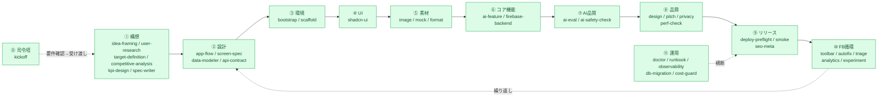

# 体験フロー × スキル網羅性

エンタープライズプロトを「構想 → 設計 → 立ち上げ → 磨き → ピッチ → リリース → 運用」する開発者の**時間軸（体験フロー）**に沿って、現状 38 スキルがどのステージを担うか、そして**アプリに必要な機能ドメイン**がどこまで埋まっているかを構造的に整理する。フロー全体の入口は司令塔 `kickoff`（⓪。入口で 2 パターン選択→プラン→各ステージへの受け渡し）。

v0.3 で **②設計・⑦AI品質ステージを新設**し、仕様化・設計・AI品質・プライバシー・計測・監視の 12 スキルを追加。体験フローは **9 → 11 ステージ**になった。その後、入口の司令塔 `kickoff`（⓪）と、品質・リリース・運用を補強する `perf-check`（⑧）/ `seo-meta`（⑨）/ `db-migration`・`cost-guard`（⑪）が加わった。v0.5 で **①構想にディスカバリー層** `user-research` / `target-definition` / `competitive-analysis` / `kpi-design` を追加し、`kickoff` を「クイックビルド / 構想先行」2パターンに再構成。現在は **⓪〜⑪ × 38 スキル**。

---

## 1. 体験フロー全体図（⓪ + 11 ステージ）



---

## 2. ステージ → スキル対応表

| # | ステージ | スキル | 主トリガ |
|---|---|---|---|
| ⓪ | 司令塔 | `kickoff`（入口で 2 パターン選択 A:クイックビルド / B:構想先行→プラン→①〜⑩へ受け渡し→dev 作業→プレビュー URL 出力） | `/start` / 「◯◯作って」等で自律 |
| ① | 構想 | `idea-framing`, `user-research`, `target-definition`, `competitive-analysis`, `kpi-design`, `spec-writer` | `/idea-framing` `/user-research` `/target` `/competitor` `/kpi` `/spec` |
| ② | 設計 | `app-flow-designer`, `screen-spec`, `data-modeler`, `api-contract` | `/app-flow` `/screen-spec` `/data-model` `/api-contract` |
| ③ | 環境 | `project-bootstrap`, `project-scaffold` | `/project-bootstrap` `/project-init` |
| ④ | UI構築 | `shadcn-ui` | 自律 |
| ⑤ | 素材 | `image-gen`, `mockdata-ja`, `format-ja` | 自律 / `/format-ja` |
| ⑥ | コア機能 | `ai-feature`, `firebase-backend` | `/ai-feature` `/firebase` `/auth-rules` |
| ⑦ | AI品質 | `ai-eval`, `ai-safety-check` | `/ai-eval` `/ai-safety` |
| ⑧ | 品質 | `design-review`, `pitch-review`, `privacy-check`, `perf-check` | `/design-review` `/pitch-review` `/privacy-check` `/perf-check` |
| ⑨ | リリース | `deploy-preflight`, `smoke-test`, `seo-meta` | `/deploy-check` `/smoke-test` `/seo-meta` |
| ⑩ | FB循環 | `vercel-toolbar-loop`, `vscode-autofix-loop`, `feedback-triage`, `analytics-events`, `experiment-plan` | `/toolbar-pull` `/feedback-triage` `/analytics-events` `/experiment` |
| ⑪ | 運用 | `settings-doctor`, `docs-runbook`, `observability-setup`, `db-migration`, `cost-guard` | `/doctor` `/docs-runbook` `/observability` `/db-migration` `/cost-guard` |

---

## 3. 機能ドメイン網羅性ヒートマップ

```
機能ドメイン               必要度  カバー                              網羅度
─────────────────────────────────────────────────────────────────────────────
構想/問題設定              ★★    idea-framing                        ██████░░  ✅
仕様化(PRD/受入/MVP)       ★★★   spec-writer                         ███████░  ✅
設計(導線/画面/データ/API)  ★★★   app-flow/screen-spec/data/api       ███████░  ✅
─────────────────────────────────────────────────────────────────────────────
UIデザイン(実装)           ★★★   shadcn-ui + design-review           ████████  ✅
レスポンシブ(スマホ/Tab/PC)★★★   shadcn-ui + design-review + smoke   ███████░  ✅
UI素材/モック/フォーマット ★★    image-gen / mockdata-ja / format-ja ███████░  ✅
─────────────────────────────────────────────────────────────────────────────
AI機能(実装)               ★★★   ai-feature (Vercel AI SDK)          ███████░  ✅
AI品質(評価/安全性)         ★★★   ai-eval / ai-safety-check           ███████░  ✅
DB/認証/本格BE             ★★★   firebase-backend → GCP              ███████░  ✅
バックエンド/API           ★★★   Next.js native + api-contract       ██████░░  ✅
─────────────────────────────────────────────────────────────────────────────
品質/プライバシー/性能     ★★    design/pitch/privacy + perf-check   ███████░  ✅
テスト/リリース/SEO        ★★★   smoke/deploy-preflight + seo-meta   ████████  ✅
FB循環/計測/実験           ★★★   toolbar/triage/analytics/experiment ███████░  ✅
運用/監視/診断             ★★    doctor/runbook/observability-setup  ███████░  ✅
DB移行/コスト防衛          ★★    db-migration / cost-guard           ███████░  ✅
```

「設計 vs 実装」を分離しているのが特徴: 設計（data-modeler / api-contract / screen-spec）が docs を生み、実装（firebase-backend / api-patterns / shadcn-ui）がそれを受ける。

---

## 4. 設計と実装の分離（重複回避の要）

| 関心事 | 設計（②） | 実装（④⑥） |
|---|---|---|
| データ | `data-modeler`（型/ERD/コレクション） | `firebase-backend`（CRUD/Rules）, `mockdata-ja`（モック） |
| API | `api-contract`（I/O・エラー・認証） | `project-scaffold` api-patterns, `ai-feature`, `firebase-backend` |
| 画面 | `screen-spec`（項目/状態） | `shadcn-ui`（実装）, `design-review`（確認） |
| 認証 | `firebase-backend` `/auth-rules`（ロール設計） | `firebase-backend`（Auth/Rules 実装） |

型は 1 箇所（data-modeler / mockdata-ja）を正に共有し二重定義しない。

---

## 5. バックエンド階層（再掲）

⑥のバックエンドは [backend-strategy.md](./backend-strategy.md) の 3 Tier（Next.js native → Firebase → GCP）で段階スケール。⑪の監視は Sentry / Vercel Logs / GCP Cloud Logging に接続。

### AI プロバイダの広がり（`ai-feature`）

```
   useChat / streamText / generateObject ─▶ Vercel AI SDK + AI Gateway ─▶ Anthropic / OpenAI / Google / xAI
```

---

関連: [サーフェス比較](./surfaces.md) ／ [バックエンド階層戦略](./backend-strategy.md) ／ [アーキテクチャ](../ARCHITECTURE.md)
