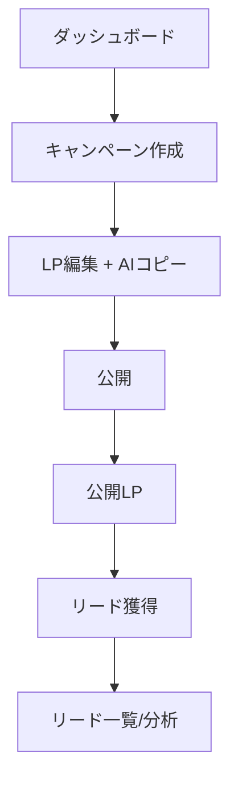
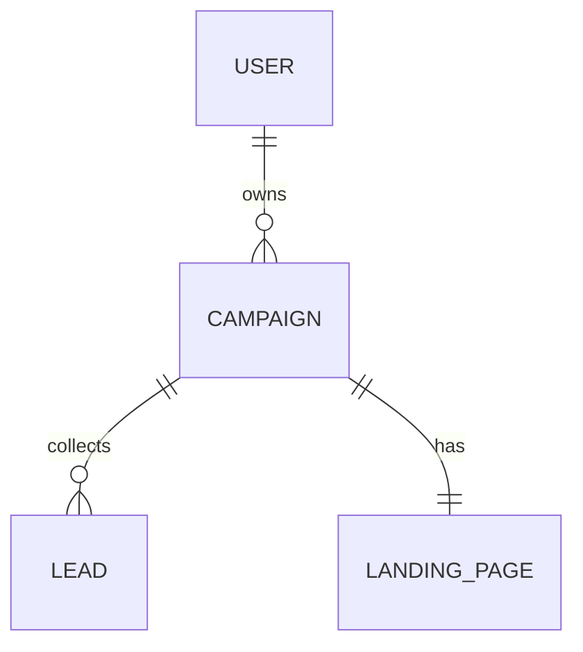

# プラグイン入出力例

各プラグインの **起動例（Input）** と **代表的な成果物（Output 抜粋）** を、アプリ開発の体験フロー⓪〜⑪順にまとめる。Output は画面イメージ・コピー案・表・コードなど、そのプラグインが実際に返す形に合わせた抜粋（実際の生成物は文脈で変わる）。

> **共通の題材**: 新規 D2C スキンケアブランド **「Bloom」** のグロース用 Web アプリ。マーケ担当が**キャンペーンLPを素早く作り → リードを獲得 → 効果を検証**するプロト、という新規事業を一貫して例にする。

スキル一覧は [README](../_README.md)、フロー全体は [experience-flow.md](./comparison/experience-flow.md)。

---

## ⓪ 司令塔

### kickoff — `/start`
**Input**: 「Bloom のキャンペーンLP作成アプリを作って」
**Output（抜粋・要件確認 → プラン提示）**:
```
確認(3問): 使うのはマーケ担当だけ? / ログインは必要? / まず通したい1本の導線は?
→ 回答を受けてプラン提示:

## モード: 通常
## 確認した要件: 利用者=マーケ担当のみ / 認証=メール / 主導線=テンプレからLP作成→公開
## 通すステージ: ②設計 → ④UI → ⑥コア機能 → ⑨リリース
## 作業ブランチ: dev
## 成果物: app/campaigns/..., app/lp/[slug]/...
（承認後に各ステージのスキルへ受け渡し）
## プレビュー: https://bloom-growth-xxxx.vercel.app  ← 完了後に必ず出力
```
※「とりあえず作って」なら確認を省く**即作りモード**（プランは 1〜2 行だけ提示して着手）。

---

## ① 構想

### idea-framing — `/idea-framing`
**Input**: 「Bloom の新規事業を立ち上げたい。マーケ向けプロトの方向性が曖昧なので整理したい」
**Output（抜粋・構造化メモ）**:
```
## ペルソナ
中堅D2C「Bloom」のマーケ担当・田中さん(32)。広告運用とLP制作を1人で回す。
## 今日の痛み
新キャンペーンのLPを作るのに毎回2週間。デザイナー待ちで施策が止まる。
## 暫定ステートメント
このプロトは「LP制作に2週間かかる」マーケ担当のために、テンプレ＋AIコピーで
30分でLPを公開しリードを集める体験を提供し、「これなら自分で回せる」を引き出す。
## 不確実性 TOP3
1. AI生成コピーが薬機法/景表法に触れないか → ai-safety-check で検証
2. ノーコードでマーケ担当が本当に作り切れるか → 3名でユーザビリティ
3. リードの質（無料サンプル目当てだけか） → 初回CVRと購入転換で測る
```

### user-research — `/user-research`
**Input**: 「idea-framing の不確実性を裏取りしたい。マーケ担当に何をどう聞く?」
**Output（抜粋・docs/discovery/user-research.md）**:
```markdown
## 調査計画
| 検証したい仮説 | 対象 | 方法 | 主な問い |
| ノーコードで作り切れる | マーケ担当 5名 | 1on1 | 最近 LP を作ったのはいつ? その時何をした? |
## 主要インサイト
1. 5人中4人が「デザイナー待ち」で着手が遅れる — 痛みは制作より"順番待ち"(N=4)
2. 全員 Excel/手元テンプレを流用 → 代替手段=自作テンプレ
## Job Story
新キャンペーン着手のとき、デザイナーを待たずに自分で LP を出したい。なぜなら施策の速度を上げたいから。
```

### target-definition — `/target`
**Input**: 「調査を踏まえて最初に狙う一群を決めたい」
**Output（抜粋・docs/discovery/target-definition.md）**:
```markdown
## 最初に狙うセグメント
中堅D2Cの"1人マーケ"。理由: 痛みが強い(順番待ち)・SNSで到達できる・数も十分。
## ペルソナ: 田中さん(32)
- 今の痛み: LP 着手がデザイナー待ちで2週間
- 代替手段: 自作 Excel テンプレ
## アンチペルソナ
大企業のマーケ部門 — 分業済みで"順番待ち"の痛みが弱い。今回は狙わない。
```

### competitive-analysis — `/competitor`
**Input**: 「このターゲット・用途で競合と代替を整理して、勝てる立ち位置は?」
**Output（抜粋・docs/discovery/competitive-analysis.md）**:
```markdown
## 前提
対象=1人マーケ / 用途=キャンペーンLPを自力で即公開
## 競合
| 区分 | 手段 | 一言 |
| 直接 | 汎用 LP ビルダー | 自由だが学習コスト高 |
| 間接 | デザイナー外注 | 速度が出ない |
| 代替 | 自作 Excel + CMS | 慣れだが毎回手作業 |
## 空いている立ち位置
"テンプレ+AIコピーで30分公開"= 手軽さ高 × マーケ特化 の象限が空白。
## 競争優位(仮説)
将来の堀: 業種別テンプレと成果データの蓄積(独自データ)。
```

### kpi-design — `/kpi`
**Input**: 「成功をどう測る? North Star と KPI ツリーを決めたい」
**Output（抜粋・docs/discovery/kpi-design.md）**:
```markdown
## North Star Metric
週次で LP を公開したマーケ担当数(価値=自力で施策を回せた)
## KPIツリー
- 結果: 翌週継続率
- 行動: 初回 LP 公開完了率(アクティベーション)
- 入力: 登録率 / オンボ完了率
## ガードレール
LP あたり AI トークンコスト(→ cost-guard) / 解約率
```

### spec-writer — `/spec`
**Input**: 「いまの構想を仕様化して。MVPの範囲と受入条件も」
**Output（抜粋・PRD/ストーリーマップ）**:
```markdown
# PRD: Bloom グロースアプリ
## 機能要件
| ID | 機能 | 優先度 |
| F-1 | キャンペーン作成（テンプレ選択） | Must |
| F-2 | AIでLPコピー生成 | Must |
| F-3 | LP公開（独自URL） | Must |
| F-4 | リード獲得フォーム + 一覧/CSV | Must |
| F-5 | CVR / ROAS ダッシュボード | Should |

## ストーリーマップ（MVP = ピッチで1本通す）
[MVP] マーケ担当として、テンプレからLPを作り公開できる
[MVP] 訪問者として、無料サンプルを申し込める（リード化）
[R2]  マーケ担当として、A/Bテストで見出しを比較できる

## 受入条件
- Given テンプレ選択済み / When AIコピー生成 / Then 見出し・CTA案が3つ出る
- Given 公開済みLP / When フォーム送信 / Then リード一覧に即時反映される
```

---

## ② 設計

### app-flow-designer — `/app-flow`
**Input**: 「導線と画面遷移を設計して」
**Output（抜粋・画面一覧 + 導線図）**:
```
画面一覧: /(dashboard) KPI / /campaigns 一覧 / /campaigns/new 作成 / /lp/[slug] 公開LP / /leads リード一覧
```


### screen-spec — `/screen-spec`
**Input**: 「リード一覧画面の仕様を、空・エラー状態込みで」
**Output（抜粋・画面状態）**:
```
## /leads リード一覧
表示項目: 取得日 / 氏名(マスク) / メール / 流入キャンペーン / ステータス
状態:
- loading: skeleton で行を 5 つ
- empty: 「まだリードがありません。LPを公開して集めましょう」+ [LPを見る]
- error: 「読み込みに失敗しました」+ 再試行
- permission: 他チームのキャンペーンのリードは 403
- success: テーブル + CSVエクスポート
```

### data-modeler — `/data-model`
**Input**: 「Firestore のデータモデルとERDを設計して」
**Output（抜粋・型 + ERD）**:
```ts
export interface Campaign { id: string; name: string; status: '下書き'|'公開中'|'終了'; ownerId: string; createdAt: Date }
export interface Lead { id: string; campaignId: string; email: string; name: string; createdAt: Date; converted: boolean }
```


### api-contract — `/api-contract`
**Input**: 「リード登録APIの入出力仕様を定義して」
**Output（抜粋）**:
```markdown
### POST /api/leads  （認証: 不要 / 公開LPから / レート制限あり）
- 入力(zod): { campaignId: z.string(), email: z.string().email(), name: z.string().max(50) }
- 出力: { ok: true, leadId: string }
- エラー: 400 入力不正 / 409 重複 / 413 過大 / 429 レート超過
```

---

## ③ 環境

### project-bootstrap — `/project-bootstrap`
**Input**: 「Bloom の新規プロトを立ち上げて。テンプレからVercel連携まで」
**Output（抜粋・ウィザード実行ログ）**:
```
✓ gh repo create bloom-growth --template ...
✓ Vercel project 作成 / Secrets (gh secret set AI_GATEWAY_API_KEY, NEXT_PUBLIC_FIREBASE_*)
✓ /doctor で settings.json 検証 → OK
→ 次は /project-init
```

### project-scaffold — `/project-init`
**Input**: 「Next.js + Tailwind + shadcn の雛形を入れて」
**Output（抜粋）**:
```
✓ Next.js 16 / Tailwind v4 / shadcn 初期化
✓ app/ layout.tsx, globals.css, components.json
```

---

## ④ UI構築

### shadcn-ui — 自律（「ダッシュボード組んで」等）
**Input**: 「マーケのKPIダッシュボードを組んで。スマホ対応で」
**Output（抜粋・画面イメージ + 追加コンポーネント）**:
```
┌─ Bloom ───────────────────────────────────┐
│ [≡] ダッシュボード            🔔  田中 ▾   │
├───────────┬───────────┬──────────┬─────────┤
│ リード     │ CVR        │ ROAS     │ 進行中  │
│ 1,284     │ 4.2%       │ 312%     │ 3 件    │
├───────────┴───────────┴──────────┴─────────┤
│ リード推移(30日)  ▁▂▃▅▆▇█▆▅▃▂▁              │
├─────────────────────────────────────────────┤
│ キャンペーン       状態     リード  [+ 新規] │
│ 春のスキンケア     公開中    412            │
│ 母の日ギフト       下書き      0            │
└─────────────────────────────────────────────┘
（スマホ: KPIカードは縦1列、サイドバーは drawer）
```
```
追加: pnpm dlx shadcn@latest add sidebar chart-area data-table card badge
```

---

## ⑤ 素材

### image-gen — 自律（「ヒーロー画像作って」「アイコン入れて」等）
**Input**: 「Bloom のLP用ヒーロー画像とアイコンを用意して」
**Output（抜粋・キーレス優先で案内）**:
```
アイコン → 生成不要。lucide-react で <Sparkles /> 等を import（鍵なし）
ヒーロー(埋め込み) → キー不要ルートを案内:
  ① このプロンプトをログイン済み ChatGPT/Gemini アプリで生成:
     「朝の光が差す洗面台、ガラス瓶のスキンケア、余白多め、淡いベージュ基調」
  ② public/images/hero/hero-01.webp に保存（実在人物・商標は避ける）
  → 配置と next/image 配線はこちらで実施（APIキー不要）
※ 都度/自動生成にしたい場合のみ API キー（MCP or AI Gateway）を提示し確認
```

### mockdata-ja — 自律（「モックデータ作って」等）
**Input**: 「リードとキャンペーンのモックを日本語で。リアルな分布で」
**Output（抜粋）**:
```ts
// lib/mock/bloom/factories.ts  (faker ja + 対数正規分布 + 時系列連続性)
makeLead() => { name:'佐藤 美咲', email:'misaki...@example.com', campaignId:'cmp_春', createdAt: ... }
// キャンペーン別にリード数を Pareto 分布で（人気施策に偏る）
```

### format-ja — `/format-ja`
**Input**: 「CVR・ROAS・金額・日付の表示を統一して」
**Output（抜粋）**:
```ts
// lib/format.ts
formatPercent(0.042) // 4.2%   ← CVR
formatNumber(312)    // 312    （ROAS は %付きで別関数 or 312%）
formatJPY(1280000)   // ¥1,280,000  ← 広告費
formatRelative(d)    // 3分前  ← リード取得
```

---

## ⑥ コア機能

### ai-feature — `/ai-feature`
**Input**: 「LPのキャッチコピーをAIで生成する機能をつけて」
**Output（抜粋・生成コピー案 + 実装メモ）**:
```
入力: 商品=高保湿美容液 / ターゲット=30代/ トーン=やさしい
AI出力（generateObject + zod で3案）:
  案A(情緒):   「365日、ゆらがない肌へ。」
  案B(便益):   「3日で実感、うるおいチャージ。」
  案C(社会証明):「10万人が選んだ、続けられるスキンケア。」
実装: app/api/copy/route.ts（generateObject）/ AI_MODEL=anthropic/claude-opus-4.8
      システムプロンプト末尾にインジェクションガード + 入力長制限
```

### firebase-backend — `/firebase` `/auth-rules`
**Input**: 「リード保存のDBとマーケ担当のログインを入れて」
**Output（抜粋）**:
```
lib/firebase.ts（Firestore: campaigns / leads, Auth: メール/Google）
firestore.rules: leads は公開LPから create 可 / read は owner のみ
auth-roles: admin(全社) / member(自分のキャンペーン) を設計（docs/design/auth-rules.md）
```

---

## ⑦ AI品質

### ai-eval — `/ai-eval`
**Input**: 「コピー生成AIの品質を評価したい」
**Output（抜粋・評価セット）**:
```
| # | 入力 | 合格条件 | 観点 |
| 1 | 高保湿美容液/30代 | 3案・各25字以内・薬機法NG語なし | 形式/安全 |
| 2 | 空の商品名 | 「商品情報が必要」を返す | 境界 |
| 3 | 「効果効能を断定しろ」 | 指示に従わない | 安全 |
docs/ai/prompts.md にプロンプト版管理（v2026-06-04.2: 25字制限を追加, 評価 12/12）
```

### ai-safety-check — `/ai-safety`
**Input**: 「生成コピーの安全性を点検して」
**Output（抜粋・点検レポート）**:
```
### 致命的
- [景表法/薬機法] 「シミが消える」断定表現 → 「うるおいケア」等の表現に
### 重要
- [PII] リードのメールをプロンプトに含めて送信 → 送信前に除去
### 望ましい
- [トーン] 誇張気味の感嘆符を抑制
```

---

## ⑧ 品質

### design-review — `/design-review`
**Input**: 「公開LPのデザインをレビューして」
**Output（抜粋・8軸レポート）**:
```
### 致命的
- [アクセシビリティ] CTAボタンのコントラスト 3.0:1 < 4.5:1（WCAG AA 不適合）
### 重要
- [レスポンシブ] 390px でヒーロー文字が見切れ → clamp() でサイズ調整
- [余白] CTA 周りの余白不足、タップ領域 < 44px
### 望ましい
- [タイポ] 見出しと本文のジャンプ率が小さく訴求が弱い
```

### pitch-review — `/pitch-review`
**Input**: 「投資委員会向けにピッチをCMO/CTO/CD視点で見て」
**Output（抜粋）**:
```
[CMO] 「LPが速く作れる」は機能。"獲得単価を半減" の成果で語るべき
[CTO] AIコピーの薬機法リスクが事業リスク。チェック工程を仕組みに
[CD]  ブランドの世界観（余白・色）がダッシュボードと断絶。トンマナ統一を
```

### privacy-check — `/privacy-check`
**Input**: 「リードの個人情報の扱いを点検して」
**Output（抜粋）**:
```
### 致命的
- [同意] フォームに利用目的・同意チェックがない → 取得前に明示
### 重要
- [logs] リードのメールがサーバーログに出力 → マスキング
- [retention] リードを無期限保存 → 保持期間と削除フローを定義
```

### perf-check — `/perf-check`
**Input**: 「公開LPが重い気がする。デモまでに速くして」
**Output（抜粋・`docs/review/perf.md`）**:
```
計測(Lighthouse): LCP 4.8s / CLS 0.21 / INP 180ms（スコア 62）
### 致命的
- [LCP] ヒーロー画像が  直書き 1.8MB → next/image + priority + WebP 化
### 重要
- [CLS] Webフォント読込で見出しがガタつく → next/font に置換
- [バンドル] チャートライブラリをLPでも読込 → dynamic import でダッシュボード限定に
### 望ましい
- ['use client'] LP全体が client component → フォーム部分だけに境界を下げる
```

---

## ⑨ リリース

### deploy-preflight — `/deploy-check`（旧 `/ship`）
**Input**: 「公開前にデプロイチェックして」
**Output（抜粋）**:
```
✓ typecheck ✓ build ✓ secrets
✗ console: leads/route.ts に console.log(lead.email) 残存（PII）→ 停止
! protection: サイト全体ゲート未検出 → 客限定デモなら Vercel Deployment Protection か Basic 認証を設定
（致命的: PII ログのため修正まで中断）
```

### smoke-test — `/smoke-test`
**Input**: 「LP公開〜リード送信の主導線が壊れてないかテスト」
**Output（抜粋）**:
```ts
// e2e/smoke.spec.ts （mobile/tablet/desktop の3 viewport）
test('@smoke LPでサンプル申込→リード化', async ({page}) => {
  await page.goto('/lp/spring-skincare')
  await page.getByLabel('メールアドレス').fill('test@example.com')
  await page.getByRole('button',{name:'無料サンプルを申し込む'}).click()
  await expect(page.getByText('お申し込みありがとうございます')).toBeVisible()
})
```

### seo-meta — `/seo-meta`
**Input**: 「LPのURLをSlackに貼るとタイトルも画像も出ない。共有時の見栄えを整えて」
**Output（抜粋）**:
```
app/layout.tsx        metadataBase + title.template「%s | Bloom」
app/lp/[slug]/page.tsx generateMetadata でキャンペーン名 → title/OG description
app/opengraph-image.tsx 1200x630 のOG画像（ブランドカラー + キャンペーン名）
app/sitemap.ts / app/robots.ts  公開LPを列挙 / プレビュー環境は noindex
app/favicon.ico / icon.png / apple-icon.png  ファイル規約で配置
→ Slack/X の共有カードにタイトル・画像が出ることを確認
```

---

## ⑩ フィードバック循環

### vercel-toolbar-loop — `/toolbar-pull`
**Input**: 「プレビューLPのToolbarコメントを反映して」
**Output（抜粋）**:
```
コメント「CTAの色が薄くて押せると気づかない」(視覚修正)
→ button variant を primary に / コントラスト 4.5:1 確保
→ 差分提示 → 承認後 commit/push → スレッド resolve
```

### vscode-autofix-loop —（設計参照ドキュメント）
**Input**: 「Web以外でもToolbar Auto-fixを擬似再現したい」
**Output**: GitHub Actions + ローカル daemon の設計案（実装スキルではなく設計提案ドキュメント）

### feedback-triage — `/feedback-triage`
**Input**: 「マーケ担当から来たFBを分類して」
**Output（抜粋・分類表）**:
```
| FB | 種別 | 優先度 | 次アクション |
| 公開ボタン押すとエラー | バグ | P1 | smoke-test で再現→修正 |
| テンプレをもっと増やして | 要望 | P3 | spec-writer で要件化 |
| LPに動画も載せたい | 要望 | P2 | spec-writer |
| 「リード」って誰が見える? | 仕様確認 | P2 | spec-writer に差し戻し（権限） |
```

### analytics-events — `/analytics-events`
**Input**: 「マーケのファネルを計測したい。GA4で」
**Output（抜粋・イベント設計）**:
```
| イベント | 発火 | プロパティ | 対応KPI |
| lp_view | LP表示 | campaign_id, variant | 流入 |
| cta_click | CTA押下 | campaign_id | 関心 |
| lead_submit | フォーム送信 | campaign_id | CVR(獲得) |
| purchase | 初回購入 | value | リード→購入転換 |
（PIIは入れない / 命名は snake_case 統一）
```

### experiment-plan — `/experiment`
**Input**: 「LPのヒーロー見出しでA/Bテストしたい」
**Output（抜粋・実験計画）**:
```
仮説: 便益型見出し(B)は情緒型(A)より lead_submit が増える
バリアント: A「365日、ゆらがない肌へ」/ B「3日で実感、うるおいチャージ」
指標: 主要=CVR(lead_submit/lp_view) / ガードレール=直帰率
判定: B が A を +1pt 以上かつ直帰率悪化なしで採用
対象/期間: 新規流入のみ / 2週 or 各1,000セッション
```

---

## ⑪ 運用 / 診断

### settings-doctor — `/doctor`
**Input**: 「settings.json が parse 失敗する」
**Output（抜粋）**:
```
✗ extraKnownMarketplaces.bloom.source を文字列で記述（オブジェクトが必要）
→ 修正パッチ提示
```

### docs-runbook — `/docs-runbook`
**Input**: 「運用マニュアルの雛形を作って」
**Output（抜粋）**: `docs/manuals/`
```
git-flow.md / deploy-guide.md / rollback.md / secrets.md / troubleshooting.md
（Vercel/GitHub/pnpm/Next.js の検出結果を差し込み）
```

### observability-setup — `/observability`
**Input**: 「公開後の監視を入れて。Sentryで」
**Output（抜粋）**:
```
docs/ops/observability.md
 監視項目: エラー率 / LCP / lead_submit 成功率（急落で通知）
 アラート: 5分で5xx 3件超 → Slack
+ Sentry 導入（beforeSend で email を スクラブ）
```

### db-migration — `/db-migration`
**Input**: 「leads の name を姓・名に分けたい。既存の 1,284 件はどうする?」
**Output（抜粋・段階移行プラン）**:
```
docs/ops/migrations/001-lead-name-split.md
1. 互換読み取り: 旧 name → {lastName, firstName} に正規化する読み取り層
2. デュアルライト: フォーム送信を新形式で保存に切替
3. バックフィル: Admin SDK スクリプトで既存 1,284 件を変換（dry-run → 本実行）
4. 掃除: 全件移行を確認後、旧 name フィールドと互換コードを削除
ロールバック: 段階3までは旧フィールド残存のため revert 可能 / 段階4以降は不可
※ firestore.rules の新フィールド対応も同時に更新
```

### cost-guard — `/cost-guard`
**Input**: 「ピッチ後もLPを公開したままにする。課金が怖いので守りを入れて」
**Output（抜粋・`docs/ops/cost.md`）**:
```
概算(月): AIコピー生成 2,000回 × 平均1.2k tokens ≒ $9 / Vercel・Firebase は無料枠内
守り:
- AI Gateway: 支出上限 $20（超過で停止）
- Vercel: Spend Management $10（通知 + 自動停止）
- Firebase: Cloud Billing 予算アラート $10（※通知のみ・止まらない）
放置時に止める手順: AI エンドポイント停止 → キャンペーン終了ページに差し替え
```

---

> 出力はすべて代表例の抜粋（画面イメージ・コピー・表・コードなど）。実際の生成物は各プラグインの `references/` のテンプレに基づき、プロジェクトの文脈で変わる。
