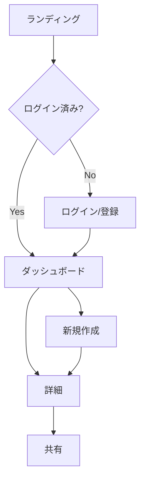
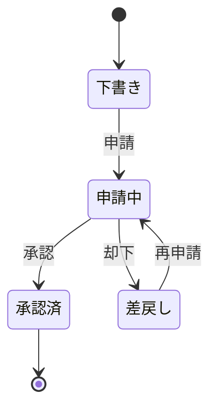

# フロー図パターン（Mermaid）

`docs/design/app-flow.md` に貼る Mermaid の型。GitHub / VS Code でレンダリングされる。

## ユーザー導線（flowchart）



## 状態遷移（stateDiagram）



## 主要ユースケース（手順）

```markdown
### UC-1: 申請を作成して承認を得る
1. ユーザーがダッシュボードで「新規作成」
2. フォーム入力 → 申請（状態: 申請中）
3. 承認者に通知（→ analytics-events / observability で計測・監視）
4. 承認者が承認（状態: 承認済）
```

## コツ

- 導線は MVP の主ゴール 1 本を太く。枝葉は省く
- 状態名は**ユーザー/業務の言葉**で（DB の enum 値ではない）。実装名は data-modeler でマッピング
- 認証が要る分岐は導線に必ず出す（auth-rules / firebase-backend と整合）

> Mermaid 構文はバージョンで差がある。レンダリングは GitHub / VS Code プレビューで確認すること。
