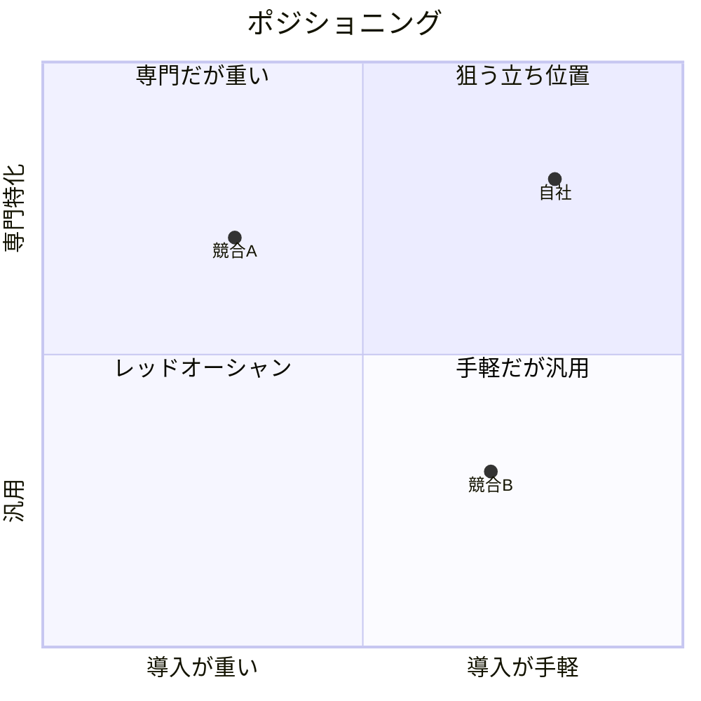

# ポジショニングと MOAT(競争優位)

## ポジショニングマップ(2軸で空白地帯を探す)

ターゲットが重視する**重要度の高い2軸**を選んで地図を描く。

```
        高 ↑ {軸B: 例 専門特化}
           |   競合A
   自社 ●  |
-----------+----------→ {軸A: 例 導入の手軽さ}
           |        競合B
        低 |  代替(Excel)
```

- 軸は「機能数 vs 価格」のような自社都合でなく、**ユーザーが選ぶ基準**から
- 狙うのは「**重要度が高いのに誰も埋めていない**象限」
- Mermaid で描く場合の例:



## MOAT(競争優位)7類型チェック

一時的な機能差は優位ではない(すぐ真似される)。**真似されても残る/守れる**理由を探す。

| 類型 | 問い | 当てはまる? |
|---|---|---|
| 独自データ | 使うほど貯まる独自データがあるか | |
| ネットワーク効果 | ユーザーが増えるほど価値が上がるか | |
| 切替コスト | 乗り換えが面倒/高くつく構造か | |
| 規模の経済 | 規模が増すほど単価が下がるか | |
| ブランド/信頼 | 名前で選ばれる領域か | |
| 独自技術/IP | 模倣困難な技術・権利か | |
| 流通/チャネル | 独占的な販路・統合先があるか | |

> プロト段階で MOAT が無くても問題ない。**「将来どこで堀を作るか」の仮説**を 1 つ持てれば十分。

## なぜ今か(idea-framing 問い4 へ)

- 数年前なら作れなかった理由(技術 / コスト / 規制 / 行動変化)
- 今この瞬間に立ち上げる必然性

## まとめ(docs に転記)

```markdown
## 狙う立ち位置
{象限}: {重要度高 × 空白} の理由

## 競争優位(仮説)
- 今の差別化: {機能/体験}(短命と自覚)
- 将来の堀: {MOAT 類型} — どう育てるか

## なぜ今か
{技術/コスト/行動変化}
```
