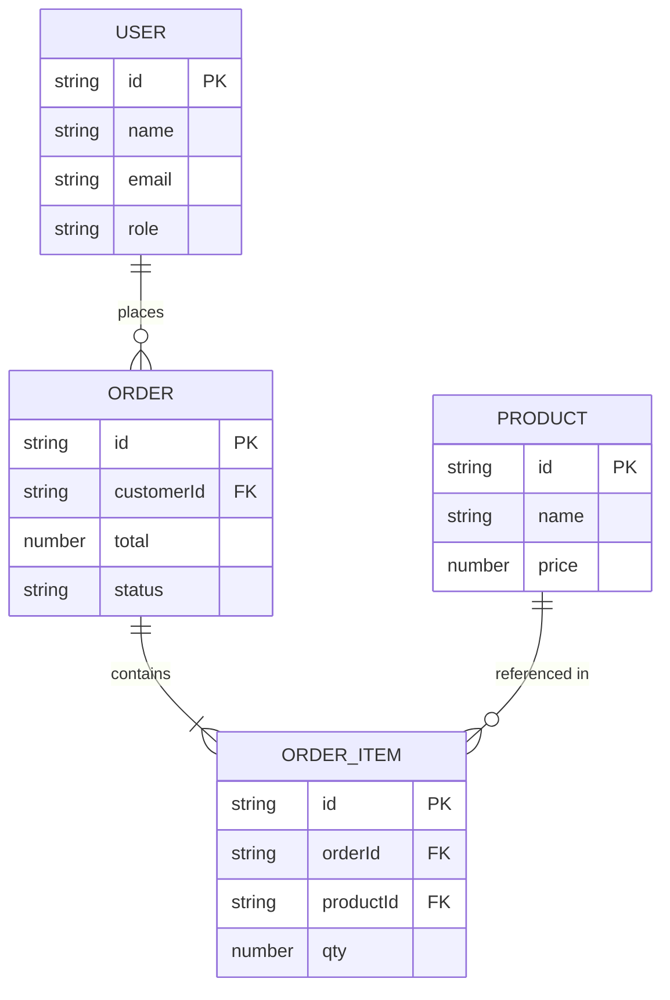

# ERD（Mermaid erDiagram）

`docs/design/data-model.md` に貼る ER 図。Firestore でも「関係の理解」のために ERD を描くと有効（実体は参照 ID）。

## 記法

- `||--o{` 1対多、`||--|{` 1対多(必須)、`}o--o{` 多対多
- PK / FK を明記。Firestore では FK は「参照 ID フィールド」
- 多対多は Firestore では中間コレクション or 配列で表現（設計時に方針を書く）

## コツ

- まず ERD で関係を確定 → [firestore-modeling.md](./firestore-modeling.md) で読み取りパターンに合わせて非正規化
- enum/状態は `app-flow` の状態遷移と一致

> Mermaid erDiagram 構文はバージョン差あり。レンダリングを確認すること。
