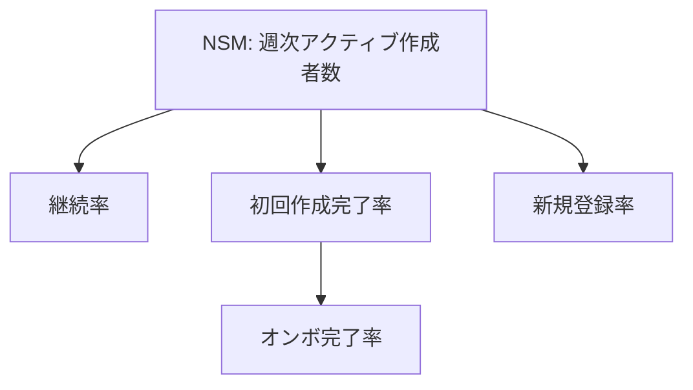

# KPIツリー雛形

North Star を「自分で動かせる入力指標」まで分解し、どこを改善すれば NSM が動くかを見えるようにする。

## 3 層構造

| 層 | 意味 | 例 |
|---|---|---|
| 結果指標 | NSM や事業成果。遅れて動く | 継続率 / 売上 |
| 行動指標 | ユーザーの鍵となる行動 | 初回作成完了 / 招待 |
| 入力指標 | 自分が直接動かせるレバー | 登録率 / オンボ完了率 |

> 施策は**入力指標**を動かす。結果指標だけ見ても何を変えればいいか分からない。

## ツリー(テキスト)

```
NSM: 週次アクティブ作成者数(WAC)
├─ 結果: 翌週継続率
├─ 行動: 初回作成完了率(アクティベーション)
│        └─ 入力: オンボーディング完了率
└─ 入力: 新規登録率 / 招待からの流入
```

## Mermaid 例



## 出力テンプレ(docs/discovery/kpi-design.md)

```markdown
## North Star Metric
{指標}: {なぜこれが価値を表すか}

## KPIツリー
- 結果: {指標}
- 行動: {指標}
- 入力(動かせるレバー): {指標}, {指標}

## ガードレール指標
- {悪化させてはいけない指標}(例: 解約率 / コスト / エラー率)

## 目標値(プロト段階・仮)
| 指標 | 今(基準線) | 目標 | いつまで |
|---|---|---|---|
| NSM | {仮} | {仮} | {時期} |
```

> 各指標は `analytics-events` で計測できる粒度か確認。測れない指標は近い代理指標に置き換える。
